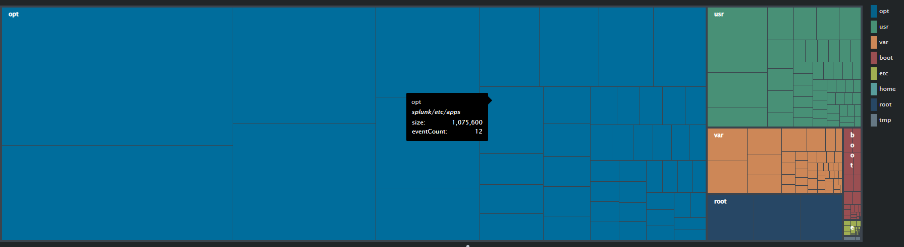

# Linux Disk Usage

## Files

| File | Description |
| ---- | ----------- |
| [linux_disk_usage.xml](linux_disk_usage.xml) | Basic dashboard using the Treemap visualisation |
| [linux_du.sh](linux_du.sh) | Simple script for grabbing file sizes on disk |
| [props.conf](props.conf) | Sample Splunk config for parsing |

## Setup

Script needs to run as root to be able to traverse the whole filesystem.
The resulting file is /tmp/du_output.psv.

```bash
# 1. Move script to /usr/local/sbin/disk.sh
# 2. Set ownership and permissions
chown root: /usr/local/sbin/disk.sh
chmod 700 /usr/local/sbin/disk.sh

# 3. Add to cron to run daily
crontab -e
#13 3 * * * root /usr/local/sbin/disk.sh
```

## Example Output

```bash
head /tmp/du_output.psv
#time_collected|size|time_modified|path
#1641768891|0|1560877517|/etc/mtab
#1641768891|4|1560877417|/etc/fstab
#1641768891|0|1560877417|/etc/crypttab
#1641768891|4|1641765346|/etc/resolv.conf
```

The dashboard looks something like this:

